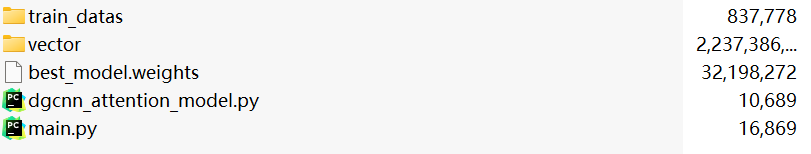
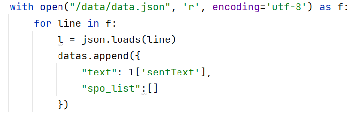
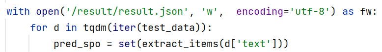

1. 选手需要将所需要的文件打包成**predictor.zip** 

   **注意直接对所有文件进行打包，不要压缩predictor文件夹**



如图所示 baseline 的模型，在顶层目录中必须包含**main.py**,作为封测程序的入口。

2. 选手如果需要使用预训练模型，需要在打包的文件 zip 包中,并在代码中本地引用，封测使用 docker 环境**不支持联网下载**。
3. 选手读取数据集的路径是'/data/data.json',数据格式如下所示：

```json
{"sentText": "被告人马某某窜至**市卫校附属医院急诊室，将郭某某放在急诊室床边椅子上的手提包盗走，包内有现金1700余元及身份证、户口本等物"}
{"sentText": "被告人谭某某伙同一名叫“阿浪”的男子（另案处理）去到**市三埠祥某五区102号812房，利用技术开锁的手段进入屋内，盗走现金18700元、金项链4条、金戒指7枚、金手链3条、金耳环1对"}
{"sentText": "1.2014年2月16日晚，被告人杨某同武某（已判刑）先后两次到**市**区南定镇山铝体育馆东面的花园路小区楼下储藏室，盗窃李某乙一辆电动自行车，王某甲一条宠物狗，刘某一辆电动自行车及一桶花生油"}
```

以 baseline 加载数据为例：

<center></center>

4. 选手提交的模型需要生成预测的结果文件，生成在/result,路径下命名为 **result.json**。**(/result/result.json)** 以 baseline 生成结果为例：

    <center></center>

    生成的 result.json 的数据条数，数据顺序都应与 data.json 保持一致。数据格式如下：

    ```json
    {"sentText": "被告人孙某于2014年9月15日23时许，窜至**市八号镇建民村八组刘某某家，采取在牛圈后墙挖窟窿的方式，将被害人刘某某家的两头耕牛牵出院子盗走，后被刘某某发现将牛追回", "relationMentions": [{"em1Text": "刘某某", "label": "posses", "em2Text": "两头耕牛"}, {"em1Text": "孙某", "label": "theft", "em2Text": "两头耕牛"}]}
    {"sentText": "2014年4月7日凌晨4时许，被告人郑某与邹某在**市惠斯顿宾馆睡觉时，盗走邹某人民币10000元", "relationMentions": [{"em1Text": "郑某", "label": "accomplice", "em2Text": "邹某"}]}
    ```

5. 评测提提供**TF2**、**torch1.9** 两种环境，选手可以根据需要进行选择，环境的具体描述见 **envs** 文件夹。

6. 如评测过程中出现问题，随时进行提问。
